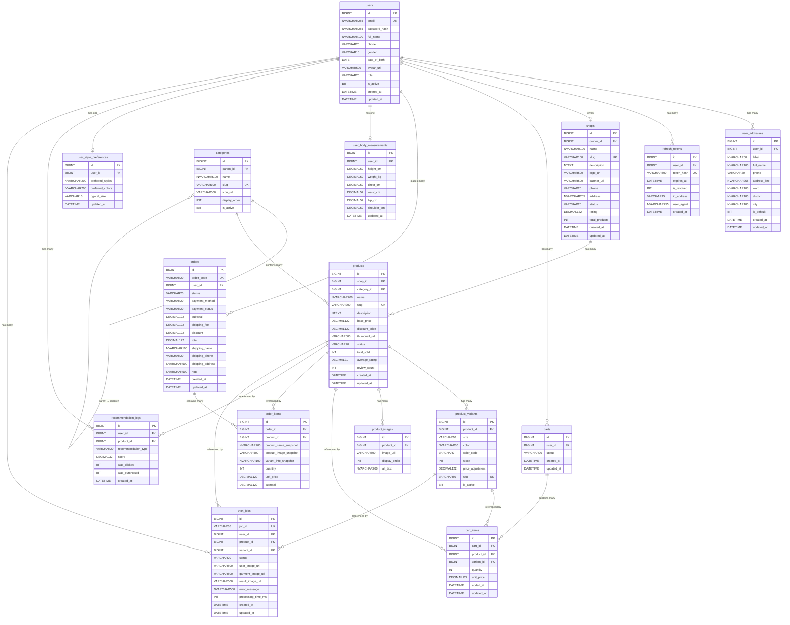

# FashionCart — Entity Relationship Diagram (ERD)

> **Phiên bản:** 1.0 — Phase 1 MVP (có chuẩn bị cho Phase 2 DSS & Phase 3 VTON)
> **Database:** SQL Server
> **Cập nhật lần cuối:** 2026-04-14
> **Tác giả:** Team FashionCart

---

## 1. Tổng quan các nhóm bảng

| Nhóm | Bảng | Mô tả |
|------|------|-------|
| **👤 Auth & Users** | `users`, `user_addresses`, `refresh_tokens` | Tài khoản, địa chỉ, xác thực |
| **🏪 Shops** | `shops` | Thông tin cửa hàng |
| **📦 Catalog** | `categories`, `products`, `product_variants`, `product_images` | Danh mục và sản phẩm |
| **🛒 Cart** | `carts`, `cart_items` | Giỏ hàng |
| **📋 Orders** | `orders`, `order_items` | Đơn hàng |
| **🤖 DSS (Phase 2)** | `user_body_measurements`, `user_style_preferences`, `recommendation_logs` | Dữ liệu cho hệ thống gợi ý |
| **👗 VTON (Phase 3)** | `vton_jobs` | Tiến trình Virtual Try-On |

---

## 2. ERD Diagram (Mermaid)



---

## 3. Chi tiết từng bảng

### 3.1 Nhóm Auth & Users

---

#### Bảng `users`
> Tài khoản người dùng — trung tâm của toàn bộ hệ thống.

| Cột | Kiểu | Nullable | Default | Ràng buộc | Mô tả |
|-----|------|----------|---------|-----------|-------|
| `id` | `BIGINT` | NO | `IDENTITY(1,1)` | `PK` | Primary key tự tăng |
| `email` | `NVARCHAR(255)` | NO | — | `UK`, `NOT NULL` | Email đăng nhập, duy nhất |
| `password_hash` | `NVARCHAR(255)` | NO | — | `NOT NULL` | Mật khẩu đã hash (bcrypt/argon2) |
| `full_name` | `NVARCHAR(100)` | NO | — | `NOT NULL` | Họ tên hiển thị |
| `phone` | `VARCHAR(20)` | YES | `NULL` | — | Số điện thoại |
| `gender` | `VARCHAR(10)` | YES | `NULL` | `CHECK IN ('male','female','other')` | Giới tính |
| `date_of_birth` | `DATE` | YES | `NULL` | — | Ngày sinh |
| `avatar_url` | `VARCHAR(500)` | YES | `NULL` | — | URL ảnh đại diện |
| `role` | `VARCHAR(20)` | NO | `'buyer'` | `CHECK IN ('buyer','shop','admin')` | Vai trò trong hệ thống |
| `is_active` | `BIT` | NO | `1` | — | Trạng thái tài khoản (soft delete) |
| `created_at` | `DATETIME` | NO | `GETDATE()` | — | Thời điểm tạo |
| `updated_at` | `DATETIME` | NO | `GETDATE()` | — | Thời điểm cập nhật cuối |

**Indexes:**
```sql
CREATE UNIQUE INDEX uk_users_email    ON users(email);
CREATE INDEX        idx_users_role    ON users(role);
CREATE INDEX        idx_users_active  ON users(is_active);
```

---

#### Bảng `user_addresses`
> Địa chỉ giao hàng — mỗi user có thể lưu nhiều địa chỉ.

| Cột | Kiểu | Nullable | Default | Ràng buộc | Mô tả |
|-----|------|----------|---------|-----------|-------|
| `id` | `BIGINT` | NO | `IDENTITY(1,1)` | `PK` | Primary key |
| `user_id` | `BIGINT` | NO | — | `FK → users(id)` | Chủ sở hữu địa chỉ |
| `label` | `NVARCHAR(50)` | YES | `NULL` | — | Tên gợi nhớ (Nhà, Công ty...) |
| `full_name` | `NVARCHAR(100)` | NO | — | `NOT NULL` | Tên người nhận |
| `phone` | `VARCHAR(20)` | NO | — | `NOT NULL` | SĐT người nhận |
| `address_line` | `NVARCHAR(255)` | NO | — | `NOT NULL` | Số nhà, tên đường |
| `ward` | `NVARCHAR(100)` | NO | — | `NOT NULL` | Phường/Xã |
| `district` | `NVARCHAR(100)` | NO | — | `NOT NULL` | Quận/Huyện |
| `city` | `NVARCHAR(100)` | NO | — | `NOT NULL` | Tỉnh/Thành phố |
| `is_default` | `BIT` | NO | `0` | — | Địa chỉ mặc định |
| `created_at` | `DATETIME` | NO | `GETDATE()` | — | Thời điểm tạo |
| `updated_at` | `DATETIME` | NO | `GETDATE()` | — | Thời điểm cập nhật |

**Indexes:**
```sql
CREATE INDEX idx_user_addresses_user ON user_addresses(user_id);
```

> **Business Rule:** Mỗi user chỉ có tối đa 1 `is_default = 1`. Khi set default mới → phải unset default cũ.

---

#### Bảng `refresh_tokens`
> Lưu trữ refresh token cho JWT authentication.

| Cột | Kiểu | Nullable | Default | Ràng buộc | Mô tả |
|-----|------|----------|---------|-----------|-------|
| `id` | `BIGINT` | NO | `IDENTITY(1,1)` | `PK` | Primary key |
| `user_id` | `BIGINT` | NO | — | `FK → users(id)` | User sở hữu token |
| `token_hash` | `VARCHAR(500)` | NO | — | `UK`, `NOT NULL` | Hash của refresh token |
| `expires_at` | `DATETIME` | NO | — | `NOT NULL` | Thời điểm hết hạn |
| `is_revoked` | `BIT` | NO | `0` | — | Token đã bị thu hồi |
| `ip_address` | `VARCHAR(45)` | YES | `NULL` | — | IP đăng nhập |
| `user_agent` | `NVARCHAR(255)` | YES | `NULL` | — | Browser/device info |
| `created_at` | `DATETIME` | NO | `GETDATE()` | — | Thời điểm tạo |

**Indexes:**
```sql
CREATE UNIQUE INDEX uk_refresh_tokens_hash    ON refresh_tokens(token_hash);
CREATE INDEX        idx_refresh_tokens_user   ON refresh_tokens(user_id);
CREATE INDEX        idx_refresh_tokens_expiry ON refresh_tokens(expires_at) WHERE is_revoked = 0;
```

---

### 3.2 Nhóm Shops

---

#### Bảng `shops`
> Thông tin cửa hàng — mỗi shop gắn với một user có role = 'shop'.

| Cột | Kiểu | Nullable | Default | Ràng buộc | Mô tả |
|-----|------|----------|---------|-----------|-------|
| `id` | `BIGINT` | NO | `IDENTITY(1,1)` | `PK` | Primary key |
| `owner_id` | `BIGINT` | NO | — | `FK → users(id)`, `UK` | User sở hữu shop (1-1) |
| `name` | `NVARCHAR(100)` | NO | — | `NOT NULL` | Tên shop |
| `slug` | `VARCHAR(100)` | NO | — | `UK`, `NOT NULL` | URL-friendly name |
| `description` | `NTEXT` | YES | `NULL` | — | Mô tả shop |
| `logo_url` | `VARCHAR(500)` | YES | `NULL` | — | URL logo |
| `banner_url` | `VARCHAR(500)` | YES | `NULL` | — | URL banner |
| `phone` | `VARCHAR(20)` | YES | `NULL` | — | SĐT liên hệ |
| `address` | `NVARCHAR(255)` | YES | `NULL` | — | Địa chỉ shop |
| `status` | `VARCHAR(20)` | NO | `'active'` | `CHECK IN ('active','suspended','closed')` | Trạng thái hoạt động |
| `rating` | `DECIMAL(3,2)` | NO | `0.00` | `CHECK BETWEEN 0 AND 5` | Đánh giá trung bình |
| `total_products` | `INT` | NO | `0` | — | Tổng số sản phẩm (cache) |
| `created_at` | `DATETIME` | NO | `GETDATE()` | — | Thời điểm tạo |
| `updated_at` | `DATETIME` | NO | `GETDATE()` | — | Thời điểm cập nhật |

**Indexes:**
```sql
CREATE UNIQUE INDEX uk_shops_owner ON shops(owner_id);
CREATE UNIQUE INDEX uk_shops_slug  ON shops(slug);
CREATE INDEX        idx_shops_status ON shops(status);
```

---

### 3.3 Nhóm Catalog

---

#### Bảng `categories`
> Danh mục sản phẩm, hỗ trợ cấu trúc cây (2 cấp cho Phase 1).

| Cột | Kiểu | Nullable | Default | Ràng buộc | Mô tả |
|-----|------|----------|---------|-----------|-------|
| `id` | `BIGINT` | NO | `IDENTITY(1,1)` | `PK` | Primary key |
| `parent_id` | `BIGINT` | YES | `NULL` | `FK → categories(id)` | Danh mục cha (NULL = root) |
| `name` | `NVARCHAR(100)` | NO | — | `NOT NULL` | Tên danh mục |
| `slug` | `VARCHAR(100)` | NO | — | `UK`, `NOT NULL` | URL-friendly name |
| `icon_url` | `VARCHAR(500)` | YES | `NULL` | — | URL icon/ảnh danh mục |
| `display_order` | `INT` | NO | `0` | — | Thứ tự hiển thị |
| `is_active` | `BIT` | NO | `1` | — | Ẩn/hiện danh mục |

**Cấu trúc dữ liệu demo:**
```
Level 1 (parent_id = NULL)
├── id=1  Thời trang nam    (slug: thoi-trang-nam)
├── id=2  Thời trang nữ     (slug: thoi-trang-nu)
└── id=3  Phụ kiện          (slug: phu-kien)

Level 2 (parent_id = <level1 id>)
├── id=4  Áo thun nam       (parent=1, slug: ao-thun-nam)
├── id=5  Áo sơ mi          (parent=1, slug: ao-so-mi)
├── id=6  Quần jeans nam    (parent=1, slug: quan-jeans-nam)
├── id=7  Áo croptop        (parent=2, slug: ao-croptop)
├── id=8  Đầm / Váy         (parent=2, slug: dam-vay)
├── id=9  Quần jeans nữ     (parent=2, slug: quan-jeans-nu)
├── id=10 Chân váy          (parent=2, slug: chan-vay)
├── id=11 Mũ / Nón          (parent=3, slug: mu-non)
└── id=12 Túi xách          (parent=3, slug: tui-xach)
```

**Indexes:**
```sql
CREATE UNIQUE INDEX uk_categories_slug    ON categories(slug);
CREATE INDEX        idx_categories_parent ON categories(parent_id);
```

---

#### Bảng `products`
> Sản phẩm — trung tâm của module catalog.

| Cột | Kiểu | Nullable | Default | Ràng buộc | Mô tả |
|-----|------|----------|---------|-----------|-------|
| `id` | `BIGINT` | NO | `IDENTITY(1,1)` | `PK` | Primary key |
| `shop_id` | `BIGINT` | NO | — | `FK → shops(id)` | Shop sở hữu |
| `category_id` | `BIGINT` | NO | — | `FK → categories(id)` | Danh mục |
| `name` | `NVARCHAR(200)` | NO | — | `NOT NULL` | Tên sản phẩm |
| `slug` | `VARCHAR(200)` | NO | — | `UK`, `NOT NULL` | URL-friendly name |
| `description` | `NTEXT` | YES | `NULL` | — | Mô tả chi tiết |
| `base_price` | `DECIMAL(12,2)` | NO | — | `NOT NULL`, `CHECK > 0` | Giá gốc (VND) |
| `discount_price` | `DECIMAL(12,2)` | YES | `NULL` | `CHECK > 0` | Giá sau giảm (NULL = không giảm) |
| `thumbnail_url` | `VARCHAR(500)` | YES | `NULL` | — | Ảnh đại diện chính |
| `status` | `VARCHAR(20)` | NO | `'active'` | `CHECK IN ('active','draft','hidden','deleted')` | Trạng thái |
| `total_sold` | `INT` | NO | `0` | — | Tổng đã bán (cache) |
| `average_rating` | `DECIMAL(2,1)` | NO | `0.0` | `CHECK BETWEEN 0 AND 5` | Đánh giá TB |
| `review_count` | `INT` | NO | `0` | — | Số lượt đánh giá |
| `created_at` | `DATETIME` | NO | `GETDATE()` | — | Thời điểm tạo |
| `updated_at` | `DATETIME` | NO | `GETDATE()` | — | Thời điểm cập nhật |

**Indexes:**
```sql
CREATE UNIQUE INDEX uk_products_slug        ON products(slug);
CREATE INDEX idx_products_shop              ON products(shop_id)       WHERE status = 'active';
CREATE INDEX idx_products_category          ON products(category_id)   WHERE status = 'active';
CREATE INDEX idx_products_price             ON products(base_price)    WHERE status = 'active';
CREATE INDEX idx_products_created           ON products(created_at DESC) WHERE status = 'active';
CREATE INDEX idx_products_total_sold        ON products(total_sold DESC) WHERE status = 'active';
CREATE FULLTEXT INDEX ON products(name, description);  -- SQL Server FTS
```

---

#### Bảng `product_variants`
> Biến thể sản phẩm theo size và màu sắc.

| Cột | Kiểu | Nullable | Default | Ràng buộc | Mô tả |
|-----|------|----------|---------|-----------|-------|
| `id` | `BIGINT` | NO | `IDENTITY(1,1)` | `PK` | Primary key |
| `product_id` | `BIGINT` | NO | — | `FK → products(id)` | Sản phẩm cha |
| `size` | `VARCHAR(10)` | YES | `NULL` | — | Size: XS, S, M, L, XL, XXL, 28, 29... |
| `color` | `NVARCHAR(30)` | YES | `NULL` | — | Tên màu: Trắng, Đen, Xanh navy... |
| `color_code` | `VARCHAR(7)` | YES | `NULL` | `CHECK LIKE '#%'` | Mã màu hex: #FFFFFF |
| `stock` | `INT` | NO | `0` | `CHECK >= 0` | Số lượng tồn kho |
| `price_adjustment` | `DECIMAL(12,2)` | NO | `0.00` | — | Chênh lệch giá so với base_price |
| `sku` | `VARCHAR(50)` | YES | `NULL` | `UK` | Mã SKU (vd: FC-001-M-WHITE) |
| `is_active` | `BIT` | NO | `1` | — | Ẩn/hiện variant |

**Indexes:**
```sql
CREATE UNIQUE INDEX uk_product_variants_sku   ON product_variants(sku) WHERE sku IS NOT NULL;
CREATE INDEX        idx_variants_product      ON product_variants(product_id);
CREATE INDEX        idx_variants_size         ON product_variants(size);
CREATE INDEX        idx_variants_stock        ON product_variants(stock) WHERE is_active = 1;
```

> **Lưu ý:** Giá thực tế của variant = `products.base_price + product_variants.price_adjustment`

---

#### Bảng `product_images`
> Ảnh bổ sung của sản phẩm (ngoài thumbnail chính).

| Cột | Kiểu | Nullable | Default | Ràng buộc | Mô tả |
|-----|------|----------|---------|-----------|-------|
| `id` | `BIGINT` | NO | `IDENTITY(1,1)` | `PK` | Primary key |
| `product_id` | `BIGINT` | NO | — | `FK → products(id)` | Sản phẩm |
| `image_url` | `VARCHAR(500)` | NO | — | `NOT NULL` | URL ảnh (cloud storage) |
| `display_order` | `INT` | NO | `0` | — | Thứ tự hiển thị (0 = đầu tiên) |
| `alt_text` | `NVARCHAR(200)` | YES | `NULL` | — | Mô tả ảnh (SEO + accessibility) |

**Indexes:**
```sql
CREATE INDEX idx_product_images_product ON product_images(product_id, display_order);
```

---

### 3.4 Nhóm Cart

---

#### Bảng `carts`
> Giỏ hàng — mỗi user có 1 cart active tại một thời điểm.

| Cột | Kiểu | Nullable | Default | Ràng buộc | Mô tả |
|-----|------|----------|---------|-----------|-------|
| `id` | `BIGINT` | NO | `IDENTITY(1,1)` | `PK` | Primary key |
| `user_id` | `BIGINT` | NO | — | `FK → users(id)` | Chủ giỏ hàng |
| `status` | `VARCHAR(20)` | NO | `'active'` | `CHECK IN ('active','converted','abandoned')` | Trạng thái |
| `created_at` | `DATETIME` | NO | `GETDATE()` | — | Thời điểm tạo |
| `updated_at` | `DATETIME` | NO | `GETDATE()` | — | Thời điểm cập nhật cuối |

**Indexes:**
```sql
CREATE INDEX idx_carts_user_active ON carts(user_id) WHERE status = 'active';
```

> **Business Rule:** Mỗi `user_id` chỉ có tối đa 1 cart với `status = 'active'`.

---

#### Bảng `cart_items`
> Các sản phẩm trong giỏ hàng.

| Cột | Kiểu | Nullable | Default | Ràng buộc | Mô tả |
|-----|------|----------|---------|-----------|-------|
| `id` | `BIGINT` | NO | `IDENTITY(1,1)` | `PK` | Primary key |
| `cart_id` | `BIGINT` | NO | — | `FK → carts(id)` | Giỏ hàng chứa item |
| `product_id` | `BIGINT` | NO | — | `FK → products(id)` | Sản phẩm |
| `variant_id` | `BIGINT` | YES | `NULL` | `FK → product_variants(id)` | Variant (size/màu) |
| `quantity` | `INT` | NO | — | `NOT NULL`, `CHECK >= 1` | Số lượng |
| `unit_price` | `DECIMAL(12,2)` | NO | — | `NOT NULL` | Giá tại thời điểm thêm |
| `added_at` | `DATETIME` | NO | `GETDATE()` | — | Thời điểm thêm vào giỏ |
| `updated_at` | `DATETIME` | NO | `GETDATE()` | — | Thời điểm cập nhật |

**Indexes:**
```sql
CREATE INDEX idx_cart_items_cart    ON cart_items(cart_id);
CREATE UNIQUE INDEX uk_cart_items_product_variant ON cart_items(cart_id, product_id, variant_id);
```

> **Business Rule:** Mỗi cặp `(cart_id, product_id, variant_id)` là duy nhất — khi thêm trùng thì tăng `quantity`.

---

### 3.5 Nhóm Orders

---

#### Bảng `orders`
> Đơn hàng đã được tạo từ giỏ hàng.

| Cột | Kiểu | Nullable | Default | Ràng buộc | Mô tả |
|-----|------|----------|---------|-----------|-------|
| `id` | `BIGINT` | NO | `IDENTITY(1,1)` | `PK` | Primary key |
| `order_code` | `VARCHAR(20)` | NO | — | `UK`, `NOT NULL` | Mã đơn (FC-YYYYMMDD-XXX) |
| `user_id` | `BIGINT` | NO | — | `FK → users(id)` | Người đặt hàng |
| `status` | `VARCHAR(20)` | NO | `'pending'` | `CHECK IN ('pending','confirmed','shipping','delivered','cancelled')` | Trạng thái đơn |
| `payment_method` | `VARCHAR(30)` | NO | `'cod'` | `CHECK IN ('cod','bank_transfer','vnpay','momo')` | Phương thức TT |
| `payment_status` | `VARCHAR(20)` | NO | `'unpaid'` | `CHECK IN ('unpaid','paid','refunded')` | Trạng thái TT |
| `subtotal` | `DECIMAL(12,2)` | NO | — | `NOT NULL` | Tổng tiền hàng |
| `shipping_fee` | `DECIMAL(12,2)` | NO | `30000.00` | — | Phí vận chuyển |
| `discount` | `DECIMAL(12,2)` | NO | `0.00` | `CHECK >= 0` | Giảm giá |
| `total` | `DECIMAL(12,2)` | NO | — | `NOT NULL` | Tổng thanh toán |
| `shipping_name` | `NVARCHAR(100)` | NO | — | `NOT NULL` | Tên người nhận |
| `shipping_phone` | `VARCHAR(20)` | NO | — | `NOT NULL` | SĐT người nhận |
| `shipping_address` | `NVARCHAR(500)` | NO | — | `NOT NULL` | Địa chỉ giao hàng đầy đủ |
| `note` | `NVARCHAR(500)` | YES | `NULL` | — | Ghi chú đơn hàng |
| `created_at` | `DATETIME` | NO | `GETDATE()` | — | Thời điểm tạo đơn |
| `updated_at` | `DATETIME` | NO | `GETDATE()` | — | Thời điểm cập nhật |

**Indexes:**
```sql
CREATE UNIQUE INDEX uk_orders_code      ON orders(order_code);
CREATE INDEX        idx_orders_user     ON orders(user_id, created_at DESC);
CREATE INDEX        idx_orders_status   ON orders(status);
```

**Order Status Flow:**
```
pending ──→ confirmed ──→ shipping ──→ delivered
               └──────────────────────→ cancelled
```

---

#### Bảng `order_items`
> Chi tiết sản phẩm trong đơn hàng — dữ liệu được **snapshot** tại thời điểm mua.

| Cột | Kiểu | Nullable | Default | Ràng buộc | Mô tả |
|-----|------|----------|---------|-----------|-------|
| `id` | `BIGINT` | NO | `IDENTITY(1,1)` | `PK` | Primary key |
| `order_id` | `BIGINT` | NO | — | `FK → orders(id)` | Đơn hàng |
| `product_id` | `BIGINT` | YES | `NULL` | `FK → products(id)` | Reference SP gốc (nullable nếu SP bị xoá) |
| `product_name_snapshot` | `NVARCHAR(200)` | NO | — | `NOT NULL` | **Snapshot** tên sản phẩm |
| `product_image_snapshot` | `VARCHAR(500)` | YES | `NULL` | — | **Snapshot** ảnh sản phẩm |
| `variant_info_snapshot` | `NVARCHAR(100)` | YES | `NULL` | — | **Snapshot** "Size M, Màu Đen" |
| `quantity` | `INT` | NO | — | `NOT NULL`, `CHECK >= 1` | Số lượng |
| `unit_price` | `DECIMAL(12,2)` | NO | — | `NOT NULL` | Giá tại thời điểm mua |
| `subtotal` | `DECIMAL(12,2)` | NO | — | `NOT NULL` | quantity × unit_price |

**Indexes:**
```sql
CREATE INDEX idx_order_items_order   ON order_items(order_id);
CREATE INDEX idx_order_items_product ON order_items(product_id);
```

> ⚠️ **QUAN TRỌNG:** Các cột `*_snapshot` lưu dữ liệu tại thời điểm checkout. Không được JOIN sang `products` để lấy thông tin hiện tại — vì tên/giá có thể đã thay đổi.

---

### 3.6 Nhóm DSS — Phase 2

---

#### Bảng `user_body_measurements`
> Số đo cơ thể user — input cho DSS size recommendation.

| Cột | Kiểu | Nullable | Default | Ràng buộc | Mô tả |
|-----|------|----------|---------|-----------|-------|
| `id` | `BIGINT` | NO | `IDENTITY(1,1)` | `PK` | Primary key |
| `user_id` | `BIGINT` | NO | — | `FK → users(id)`, `UK` | User (1-1) |
| `height_cm` | `DECIMAL(5,2)` | YES | `NULL` | `CHECK > 0` | Chiều cao (cm) |
| `weight_kg` | `DECIMAL(5,2)` | YES | `NULL` | `CHECK > 0` | Cân nặng (kg) |
| `chest_cm` | `DECIMAL(5,2)` | YES | `NULL` | `CHECK > 0` | Số đo vòng ngực (cm) |
| `waist_cm` | `DECIMAL(5,2)` | YES | `NULL` | `CHECK > 0` | Số đo vòng eo (cm) |
| `hip_cm` | `DECIMAL(5,2)` | YES | `NULL` | `CHECK > 0` | Số đo vòng hông (cm) |
| `shoulder_cm` | `DECIMAL(5,2)` | YES | `NULL` | `CHECK > 0` | Số đo vai (cm) |
| `updated_at` | `DATETIME` | NO | `GETDATE()` | — | Lần cập nhật cuối |

---

#### Bảng `user_style_preferences`
> Sở thích thời trang — input cho DSS style recommendation.

| Cột | Kiểu | Nullable | Default | Ràng buộc | Mô tả |
|-----|------|----------|---------|-----------|-------|
| `id` | `BIGINT` | NO | `IDENTITY(1,1)` | `PK` | Primary key |
| `user_id` | `BIGINT` | NO | — | `FK → users(id)`, `UK` | User (1-1) |
| `preferred_styles` | `NVARCHAR(200)` | YES | `NULL` | — | JSON array: ["casual","streetwear"] |
| `preferred_colors` | `NVARCHAR(200)` | YES | `NULL` | — | JSON array: ["trắng","đen","navy"] |
| `typical_size` | `VARCHAR(10)` | YES | `NULL` | — | Size thường mặc: S, M, L... |
| `updated_at` | `DATETIME` | NO | `GETDATE()` | — | Lần cập nhật cuối |

---

#### Bảng `recommendation_logs`
> Log mỗi lần hệ thống gợi ý sản phẩm — dữ liệu train DSS.

| Cột | Kiểu | Nullable | Default | Ràng buộc | Mô tả |
|-----|------|----------|---------|-----------|-------|
| `id` | `BIGINT` | NO | `IDENTITY(1,1)` | `PK` | Primary key |
| `user_id` | `BIGINT` | NO | — | `FK → users(id)` | User nhận gợi ý |
| `product_id` | `BIGINT` | NO | — | `FK → products(id)` | Sản phẩm được gợi ý |
| `recommendation_type` | `VARCHAR(20)` | NO | — | `CHECK IN ('for_you','similar','size_match')` | Loại gợi ý |
| `score` | `DECIMAL(4,3)` | YES | `NULL` | `CHECK BETWEEN 0 AND 1` | Điểm confidence của model |
| `was_clicked` | `BIT` | NO | `0` | — | User có click vào không |
| `was_purchased` | `BIT` | NO | `0` | — | User có mua không |
| `created_at` | `DATETIME` | NO | `GETDATE()` | — | Thời điểm gợi ý |

**Indexes:**
```sql
CREATE INDEX idx_rec_logs_user    ON recommendation_logs(user_id, created_at DESC);
CREATE INDEX idx_rec_logs_product ON recommendation_logs(product_id);
```

---

### 3.7 Nhóm VTON — Phase 3

---

#### Bảng `vton_jobs`
> Tiến trình xử lý Virtual Try-On — async background jobs.

| Cột | Kiểu | Nullable | Default | Ràng buộc | Mô tả |
|-----|------|----------|---------|-----------|-------|
| `id` | `BIGINT` | NO | `IDENTITY(1,1)` | `PK` | Primary key |
| `job_id` | `VARCHAR(36)` | NO | — | `UK`, `NOT NULL` | UUID của Celery job |
| `user_id` | `BIGINT` | NO | — | `FK → users(id)` | User yêu cầu |
| `product_id` | `BIGINT` | NO | — | `FK → products(id)` | Sản phẩm muốn thử |
| `variant_id` | `BIGINT` | YES | `NULL` | `FK → product_variants(id)` | Variant cụ thể (optional) |
| `status` | `VARCHAR(20)` | NO | `'queued'` | `CHECK IN ('queued','processing','completed','failed')` | Trạng thái job |
| `user_image_url` | `VARCHAR(500)` | NO | — | `NOT NULL` | URL ảnh user đã upload |
| `garment_image_url` | `VARCHAR(500)` | NO | — | `NOT NULL` | URL ảnh quần áo |
| `result_image_url` | `VARCHAR(500)` | YES | `NULL` | — | URL ảnh kết quả try-on |
| `error_message` | `NVARCHAR(500)` | YES | `NULL` | — | Thông báo lỗi nếu thất bại |
| `processing_time_ms` | `INT` | YES | `NULL` | — | Thời gian xử lý (ms) |
| `created_at` | `DATETIME` | NO | `GETDATE()` | — | Thời điểm tạo job |
| `updated_at` | `DATETIME` | NO | `GETDATE()` | — | Thời điểm cập nhật |

**Indexes:**
```sql
CREATE UNIQUE INDEX uk_vton_jobs_job_id ON vton_jobs(job_id);
CREATE INDEX        idx_vton_jobs_user  ON vton_jobs(user_id, created_at DESC);
CREATE INDEX        idx_vton_jobs_status ON vton_jobs(status) WHERE status IN ('queued','processing');
```

---

## 4. Tổng hợp quan hệ giữa các bảng

| Bảng cha | Bảng con | Quan hệ | FK | On Delete |
|----------|-----------|---------|----|-----------|
| `users` | `user_addresses` | 1 - N | `user_id` | CASCADE |
| `users` | `refresh_tokens` | 1 - N | `user_id` | CASCADE |
| `users` | `shops` | 1 - 1 | `owner_id` | RESTRICT |
| `users` | `carts` | 1 - N | `user_id` | RESTRICT |
| `users` | `orders` | 1 - N | `user_id` | RESTRICT |
| `users` | `user_body_measurements` | 1 - 1 | `user_id` | CASCADE |
| `users` | `user_style_preferences` | 1 - 1 | `user_id` | CASCADE |
| `users` | `recommendation_logs` | 1 - N | `user_id` | CASCADE |
| `users` | `vton_jobs` | 1 - N | `user_id` | RESTRICT |
| `shops` | `products` | 1 - N | `shop_id` | RESTRICT |
| `categories` | `categories` | 1 - N (self) | `parent_id` | RESTRICT |
| `categories` | `products` | 1 - N | `category_id` | RESTRICT |
| `products` | `product_variants` | 1 - N | `product_id` | CASCADE |
| `products` | `product_images` | 1 - N | `product_id` | CASCADE |
| `products` | `cart_items` | 1 - N | `product_id` | RESTRICT |
| `products` | `order_items` | 1 - N | `product_id` | SET NULL |
| `products` | `recommendation_logs` | 1 - N | `product_id` | CASCADE |
| `products` | `vton_jobs` | 1 - N | `product_id` | RESTRICT |
| `product_variants` | `cart_items` | 1 - N | `variant_id` | RESTRICT |
| `product_variants` | `vton_jobs` | 1 - N | `variant_id` | SET NULL |
| `carts` | `cart_items` | 1 - N | `cart_id` | CASCADE |
| `orders` | `order_items` | 1 - N | `order_id` | CASCADE |

---

## 5. Naming Conventions DB

| Đối tượng | Convention | Ví dụ |
|-----------|-----------|-------|
| Table | `snake_case`, số nhiều | `products`, `order_items` |
| Column | `snake_case` | `created_at`, `unit_price` |
| Primary Key | `id` | `id` |
| Foreign Key | `<table_singular>_id` | `user_id`, `product_id` |
| Unique Key | `uk_<table>_<column>` | `uk_users_email` |
| Index | `idx_<table>_<column>` | `idx_products_category` |
| Check Constraint | `ck_<table>_<desc>` | `ck_products_price_positive` |

---

## 6. Thứ tự tạo bảng (Migration Order)

```
1.  users
2.  refresh_tokens          (FK → users)
3.  user_addresses          (FK → users)
4.  shops                   (FK → users)
5.  categories              (FK → categories — self ref)
6.  products                (FK → shops, categories)
7.  product_variants        (FK → products)
8.  product_images          (FK → products)
9.  carts                   (FK → users)
10. cart_items              (FK → carts, products, product_variants)
11. orders                  (FK → users)
12. order_items             (FK → orders, products)
13. user_body_measurements  (FK → users)
14. user_style_preferences  (FK → users)
15. recommendation_logs     (FK → users, products)
16. vton_jobs               (FK → users, products, product_variants)
```

---

## 7. Tham chiếu

- **Team conventions:** `docs/team-conventions.md`
- **Backend module docs:** `backend/BE/*.md`
- **Architecture:** `docs/architecture.md`
- **Seed data:** `scripts/seed/`
